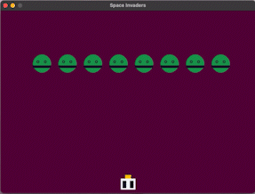

<!-- PROJECT SUMMARY -->

  <h1 align="center">Space Invaders</h1>

  

    {Inspired by the Space Invaders Japanese game}
     
    <a href="https://github.com/pink-coffee-mug/space-invaders/issues"> » submit a suggestion </a>
    ·
    <a href="https://github.com/pink-coffee-mug/space-invaders/issues">» report a bug </a>
    ·
    <a href="https://github.com/procrasprincess">» contact </a>
  

  

 

     

<!-- TABLE OF CONTENT -->

  
<h2 style="display: inline-block">🕹 Table of Content</h2>

  <ol>
    <li>
      <a href="#about-the-project">About The Project</a>
    </li>
    <li>
      <a href="#getting-started">Demo</a>
      <!-- <ul>
        <li><a href="#getting-started">Getting Started</a></li>
        <li><a href="#overview">Demo</a></li>
      </ul> -->
    </li>
    <li><a href="#contributing">Contributing</a></li>
    <li><a href="#license">License</a></li>
  </ol>

<!-- ABOUT THE PROJECT -->
## :star: About The Project
This is an implementation inspired by the Japanese game released in 1978 by Taito.

<!-- CONTENT -->

## :apple: Demo

    

<!-- CONTRIBUTING -->
## :sunflower: Contributing
Contributions are welcome! Follow these steps:
> 1. Fork the Project
> 2. Create your Branch (`git checkout -b my-branch`)
> 3. Commit your Changes (`git commit -m 'add my contribution'`)
> 4. Push to the Branch (`git push --set-upstream origin my-branch`)
> 5. Open a Pull Request

<!-- LICENSE -->
## :pencil: License

This project is licensed under [MIT](https://opensource.org/licenses).

<!-- RESOURCES-->

[contributors-shield]: https://img.shields.io/github/contributors/github_username/repo.svg?style=for-the-badge
[contributors-url]: https://github.com/github_username/repo/graphs/contributors
[forks-shield]: https://img.shields.io/github/forks/github_username/repo.svg?style=for-the-badge
[forks-url]: https://github.com/github_username/repo/network/members
[stars-shield]: https://img.shields.io/github/stars/github_username/repo.svg?style=for-the-badge
[stars-url]: https://github.com/github_username/repo/stargazers
[issues-shield]: https://img.shields.io/github/issues/github_username/repo.svg?style=for-the-badge
[issues-url]: https://github.com/github_username/repo/issues
[license-shield]: https://img.shields.io/github/license/github_username/repo.svg?style=for-the-badge
[license-url]: https://github.com/github_username/repo/blob/master/LICENSE.txt
[GitHub Pull Request (open)]:https://img.shields.io/github/issues-pr/github_username/repo-name?color=blue
[GitHub last commit]:https://img.shields.io/github/last-commit/github_username/repo-name?color=pink
